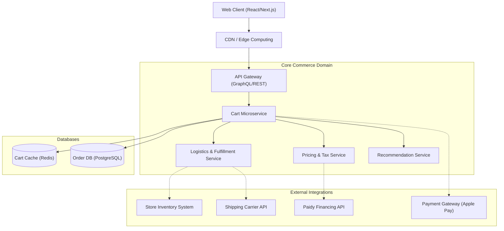

# Apple Store Shopping Cart - Architecture Design

## 1. Overview
This document outlines the system architecture for the e-commerce shopping cart experience derived from the provided Apple Store Japan checkout flow. The application provides users with real-time inventory checks (BOPIS/Delivery), cross-selling capabilities (AppleCare+, accessories), dynamic taxation, and localized third-party financing integration (Paidy).

## 2. Requirements (Functional & Non-Functional)

### Functional Requirements
* **Cart Management**: Add, remove, and manage complex configurable SKUs (e.g., M5 Pro 16-inch MacBook Pro).
* **Cross-Selling Engine**: Recommend compatible accessories (e.g., Thunderbolt 4 cables, USB-C adapters) and extended warranties (AppleCare+).
* **Logistics & Fulfillment**: 
  * Real-time in-store pickup availability (e.g., "Apple 丸の内" / Apple Marunouchi).
  * Dynamic delivery date calculation based on user postal code (e.g., 102-0091).
* **Pricing & Financing**:
  * Real-time calculation of item totals, consumption taxes, and free shipping logic.
  * Integration with 0% interest 24-month installment plans (Paidy API).
* **Checkout Integration**: Support external wallet integrations like Apple Pay alongside standard checkout flows.

### Non-Functional Requirements
* **High Availability**: 99.99% uptime, especially critical during major product launches.
* **Low Latency**: Sub-200ms response times for cart mutations and dynamic pricing calculation.
* **Consistency**: Strong consistency for cart state; eventual consistency for inventory visualization (until hard allocation at checkout).
* **Security & Compliance**: PCI-DSS compliance, secure tokenization, and adherence to Japanese data protection regulations (APPI).

## 3. Architecture Diagram



## 4. Component Design

* **Cart Microservice**: The orchestrator for the shopping bag. Stores active sessions in a Redis cache for speed and persists to a relational database upon checkout initiation.
* **Pricing & Tax Service**: A localized rules engine that computes consumption tax (Japan standard), zero-interest financing monthly splits (e.g., 569,800 JPY / 24 months = 23,741 JPY/mo), and handles cart-level discounts.
* **Logistics & Fulfillment Service**: Interfaces with local store systems to verify physical stock for BOPIS (Buy Online, Pick Up In Store) and computes estimated transit times for home delivery.
* **Recommendation Service**: Analyzes cart contents (M5 Pro MacBook Pro) to dynamically suggest relevant, compatible SKUs (Thunderbolt cables, matched AppleCare+ tiers).

## 5. Data Flow
1. **Add to Cart**: User configures MacBook Pro -> Client sends SKU to API Gateway -> Cart Service updates Redis session -> Triggers asynchronous events to Pricing and Recommendation services.
2. **View Cart**: 
   - Cart Service retrieves items from Redis.
   - Concurrently fetches exact Paidy installment data from Pricing Service.
   - Fetches estimated delivery dates from Logistics Service using the saved postal code (102-0091).
   - Fetches cross-sells from Recommendation Service.
   - Aggregates and returns the DTO to the client.

## 6. API Contracts

### GET `/v1/cart/{session_id}`
```json
{
  "cartId": "c_12345",
  "items": [
    {
      "sku": "MBP_16_M5PRO_SB",
      "name": "M5 Pro MacBook Pro - Space Black",
      "quantity": 1,
      "price": 569800,
      "services": [
        {
          "sku": "AC_MBP_16",
          "name": "AppleCare+ for 16-inch MacBook Pro",
          "price": 62800,
          "added": false
        }
      ]
    }
  ],
  "fulfillment": {
    "shipping": {
      "postalCode": "102-0091",
      "cost": 0,
      "estimatedWindow": ["2026-03-20", "2026-03-22"]
    },
    "pickup": {
      "storeId": "S_MARUNOUCHI",
      "availableDate": "2026-03-22"
    }
  },
  "financing": {
    "provider": "PAIDY",
    "termMonths": 24,
    "monthlyInstallment": 23741,
    "totalFinanced": 569800
  },
  "summary": {
    "subtotal": 569800,
    "shippingTotal": 0,
    "grandTotal": 569800
  }
}
```

## 7. Security Architecture
* **Tokenization**: Financial details are never exposed to the core cart service; Apple Pay securely tokenizes the PAN (Primary Account Number).
* **API Security**: All inter-service communication requires mutual TLS (mTLS). Client requests are authenticated via short-lived JWTs.
* **Anti-Bot Measures**: The WAF implements rate limiting to prevent automated scraping of inventory data or cart-stuffing attacks during hardware launches.

## 8. Scalability & Performance
* **Caching Strategy**: The Cart Service relies heavily on Redis for state management. Read-heavy data like the product catalog and generic store locations are cached at the CDN edge.
* **Horizontal Scaling**: The Cart and Pricing services are deployed as stateless containers (e.g., on Kubernetes) and scaled horizontally based on CPU utilization metrics to handle traffic spikes.

## 9. Deployment Architecture
* Multi-AZ (Availability Zone) deployment within the target region (e.g., AWS `ap-northeast-1` for Japan) to ensure lowest possible latency and adherence to local data residency requirements.

## 10. Monitoring & Alerting
* **Key Metrics**: Cart abandonment rate, 3rd-party API latency (especially Paidy and Carrier APIs), inventory mismatch rate.
* **Alerting**: PagerDuty alerts triggered if the Paidy financing API latency exceeds 500ms over a 1-minute rolling window, or if checkout conversion drops anomalously.
