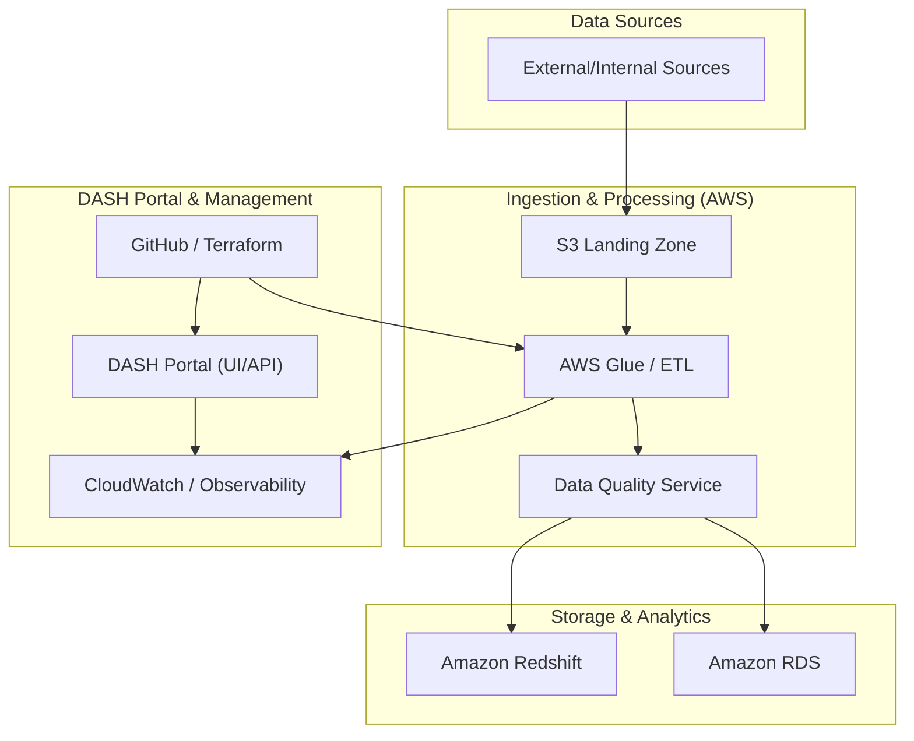

# Enterprise Data Ingestion & DASH Portal POC - Architecture Design

## 1. Overview
This document outlines the system architecture for the American Honda Motor Co., Inc. (AHM) Global Services & Data Platform (GSDP) Proof-of-Concept (POC). The project focuses on modernizing enterprise data ingestion, optimizing AWS costs, and providing production support for the DASH Portal.

## 2. Requirements

### 2.1 Functional Requirements
- **Unified Data Ingestion:** Modernize fragmented processes into a cohesive pipeline.
- **Data Quality:** Implement automated schema mapping and data quality checks.
- **DASH Portal Support:** Provide development (CI/CD, bug fixes) and operational (SLA management) support.
- **Governance:** Align with AHM GSDP governance and security frameworks.

### 2.2 Non-Functional Requirements
- **Technical Quality:** < 1% ingestion error rate.
- **Schema Compliance:** 100% compliance with defined schemas.
- **Performance:** Meet delivery milestones within ±5% timeline variance.
- **Efficiency:** Achieve at least 10% reduction in AWS infrastructure costs through automation and optimization.

## 3. Architecture Diagram

## 4. Component Design

### 4.1 Ingestion Layer
- **AWS S3:** Serves as the landing zone for raw data.
- **AWS Glue/ETL:** Handles the transformation and orchestration of data pipelines.
- **Terraform:** Manages infrastructure as code for all ingestion components.

### 4.2 Storage Layer
- **Amazon Redshift:** Primary data warehouse for analytical workloads.
- **Amazon RDS:** Used for transactional or metadata storage for the DASH Portal.

### 4.3 DASH Portal Support
- **CI/CD Pipelines:** Automated workflows for deployment and testing using GitHub Actions.
- **Production Support:** Managed services for bug fixes, UX enhancements, and incident management.

## 5. Data Flow
1. **Extraction:** Data is ingested from various sources and landed in S3.
2. **Validation:** Automated schema mapping and quality checks are performed.
3. **Transformation:** Data is cleaned and transformed to align with DASH architecture.
4. **Loading:** Transformed data is loaded into Redshift/RDS.
5. **Observability:** Metrics on ingestion health and cost are monitored via CloudWatch.

## 6. Security Architecture
- **VPC Integration:** All services deployed within AHM's VPC.
- **IAM Roles:** Principle of least privilege for service-to-service communication.
- **Encryption:** AES-256 for data at rest (S3/Redshift) and TLS for data in transit.

## 7. Scalability & Performance
- **Horizontal Scaling:** Leverage AWS Glue's serverless nature to handle varying data volumes.
- **Partitioning:** Implement S3 and Redshift partitioning strategies for optimized query performance.

## 8. Risks & Mitigations
| Risk | Impact | Mitigation |
|------|--------|------------|
| Data Inconsistency | High | Implement 100% schema validation checks in the ETL layer. |
| AWS Cost Overruns | Medium | Implement automated resource tagging and auto-scaling limits. |
| Knowledge Gap | Medium | On-site knowledge transfer (2 weeks) for FPT engineers. |
