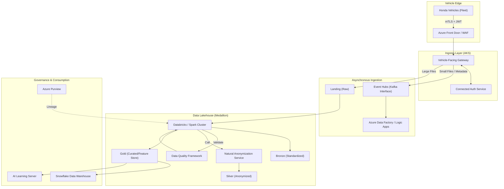

# NOA OutCAR DataOps - Architecture Design

## 1. Overview
The NOA (Navigation On Autopilot) DataOps Server is a critical foundation for Honda's next-generation connected services and Software-Defined Vehicle (SDV) domain. Its primary purpose is to collect high-volume image and video data from vehicles to support the development and training of ADAS (Advanced Driver Assistance Systems) AI models. The system is designed to be highly scalable, secure, and cost-optimized, supporting a transition from 1 million vehicles in 2026 to over 6.5 million vehicles by 2040.

## 2. Requirements (Functional & Non-Functional)

### Functional Requirements
- **Vehicle Authentication:** Secure mTLS-based authentication of Honda vehicles and issuance of JWT tokens (See [ADR-006](./specs/ADR-006-mTLS-and-Certificate-Management.md)).
- **File Distribution:** Management and delivery of provisioning and trigger files to control data collection dynamically.
- **Data Collection:** High-throughput ingestion of compressed binary data (H.265/Parquet).
- **Data Processing:** Natural Anonymization (See [ADR-007](./specs/ADR-007-Anonymization-Strategy.md)), metadata tagging, and feature extraction.
- **Data Storage:** Medallion architecture (Bronze, Silver, Gold) on tiered storage.
- **AI/ML Integration:** Integration with high-performance training clusters (Helm.ai).
- **Data Sharing:** Integration with internal systems like Snowflake for analytics.
- **Management Dashboards:** Visualization of data collection status, logs, and KPIs.

### Non-Functional Requirements
- **Scalability:** Horizontal scaling to handle massive daily ingestion.
  - **2026 Target:** 1 Million Vehicles, 1TB/day, 1,000 API rps.
  - **2040 Vision:** 6.5 Million Vehicles, 65TB/day (Minimum) to 2PB/day (Full SDV), up to 100,000 API rps.
  - *Reference:* See [ADR-004](./specs/ADR-004-Scalability-and-Storage-Strategy.md) for revised projections.
- **Availability:** 99.9%+ availability for production environments, supporting 24/365 operations.
- **Reliability:** Support for resumable uploads (5MB chunks), automatic retries with exponential backoff, and dead-letter queues. 
  - **RPO (Recovery Point Objective):** < 5 minutes for metadata; < 15 minutes for bulk media data.
  - **RTO (Recovery Time Objective):** < 4 hours for core API services; < 24 hours for full data processing pipeline recovery.
- **Security:** Zero-trust architecture, mTLS for vehicle communication, encryption at rest/transit, and PII compliance (GDPR/APPI).
- **Cost Efficiency:** Edge pre-processing to reduce upload volume and automated storage lifecycle management.
- **Cloud Native & Portable:** Utilizing containerization (K8s) for application portability across cloud providers, while acknowledging a strategic dependency on Azure-specific storage and messaging PaaS for extreme-scale data handling.

## 3. Architecture Diagram

## 4. Component Design

### Vehicle-Facing Gateway
- **Technology:** Java Spring Boot on Azure Kubernetes Service (AKS).
- **Functions:** Handles authentication handshake, validates JWTs, manages pre-signed URL generation for large uploads.
- **Patterns:** 
    - **Circuit Breaker:** Protects downstream auth services from vehicle retry storms.
    - **Rate Limiting:** Per-VIN (Vehicle Identification Number) throttling.
    - **Degraded Mode:** Ability to validate mTLS certificates locally and allow critical telemetry ingestion if the downstream *Connected Auth Platform* is unreachable.
    - **Storage Account Sharding:** Distributes traffic across multiple storage accounts to bypass IOPS limits.
- **Specification:** Detailed in [Vehicle-Facing Gateway Spec](./specs/vehicle-facing-gateway-spec.md).

### Natural Anonymization Service
- **Role:** Replaces PII with synthetic data to preserve training value.
- **Logic:** Scalable GPU-based workers using GAN/Diffusion models to process video frames asynchronously.
- **Optimization:** Selective Anonymization triggered only for data identified as "high-value" for training.
- **Reference:** See [ADR-007](./specs/ADR-007-Anonymization-Strategy.md).

### Data Processing Pipeline (Medallion Architecture)
- **Bronze Layer:** RAW data ingestion with original fidelity.
- **Silver Layer:** Cleaned data, H.265 re-encoding if necessary, and "Natural Anonymization" where PII (faces, license plates) is replaced by AI-generated overlays to preserve training value while ensuring privacy.
- **Gold Layer:** Fully tagged and indexed data ready for consumption by AI training workloads.

### Configuration & Trigger Management
- **Trigger Files:** Dynamic configuration sent to vehicles to specify what data to collect and under what conditions (e.g., specific GPS area, sensor trigger).
- **A/B Testing & Canary:** Support for deploying different trigger configurations to specific fleet segments (canary groups) to validate collection logic before global rollout.
- **Provisioning:** Directs vehicles to the correct server endpoints.

### Data Quality Framework
- **Role:** Automated validation of sensor data integrity during the Bronze -> Silver transition.
- **Functions:** Detects lens obstructions, sensor misalignment, or data corruption. Metadata is tagged with quality scores to prevent low-quality data from entering AI training sets.

## 5. Data Flow
1. **Authentication:** Vehicle initiates mTLS connection -> Gateway validates certificate -> Connected Auth Platform issues Access/Refresh JWT.
2. **Data Upload:**
   - **Large Files (>10MB):** Gateway provides a SAS (Shared Access Signature) token -> Vehicle uploads directly to Cloud Storage in 5MB-10MB chunks (resumable).
   - **Small Files (<=10MB):** Vehicle sends data via API -> Gateway performs virus scan -> Writes to Cloud Storage.
3. **Processing:** Event Grid triggers Databricks/Synapse job -> RAW data moved to Bronze -> Anonymization service called -> Transformed data stored in Silver -> Metadata extracted and stored in Gold (Parquet format).
4. **Consumption:** AI engineers query Gold layer via SQL or direct file access for model training.

## 6. Reliability & Scalability Patterns

- **Resumable Uploads:** Implementation of a custom multipart protocol to handle intermittent vehicle connectivity.
- **Dead-Letter Queues (DLQ):** All failed processing jobs are moved to a DLQ for manual inspection or automated retry.
- **Sharding:** Data in ADLS Gen2 is partitioned by `Year/Month/Day/Region/VIN` to optimize query performance and avoid hotspotting.
- **Bulkhead Pattern:** Resource isolation between "Critical Telemetry" and "Large Video Uploads" to ensure system availability during peak upload periods.

## 7. API Contracts
- `POST /v1/auth/token`: Exchanges client certificate for JWT.
- `GET /v1/provisioning`: Retrieves connectivity settings.
- `GET /v1/trigger`: Retrieves data collection logic.
- `POST /v1/upload/init`: Starts multipart upload session (returns SAS URL).
- `POST /v1/upload/complete`: Finalizes data upload and triggers processing.

## 8. Security Architecture
- **Identity:** Okta for internal user RBAC; PKI/mTLS for vehicle identity.
- **Infrastructure Security:** Private Link for all storage/database access, Azure Firewall for egress control, and WAF for ingress protection.
- **Data Privacy:** Automated PII detection and masking integrated into the ETL pipeline. Immutable audit logs for all data deletion requests (GDPR compliance).

## 9. Scalability & Performance
- **Compute:** AKS with Horizontal Pod Autoscaler (HPA) and Cluster Autoscaler.
- **Messaging:** Event Hubs with Auto-inflate for high-throughput streaming.
- **Storage:** ADLS Gen2 scales to exabytes; tiered storage policies automatically move old data to Cool/Archive tiers to save costs. Total managed data projected at 65PB+ by 2040.

## 10. Deployment Architecture & Disaster Recovery
- **Infrastructure as Code:** 100% Terraform-managed resources.
- **CI/CD:** Azure DevOps pipelines for automated build, test, and blue/green deployments.
- **Multi-Region Strategy:** Deployed across Tokyo (Primary) and Oregon (Secondary) regions for high availability.
- **Disaster Recovery:**
    - **Metadata:** Geo-redundant storage (GRS) for database and metadata.
    - **Data:** Critical Silver/Gold datasets replicated cross-region; Raw data uses LRS in primary region with periodic secondary backup.
    - **Failover:** Automated DNS switch via Azure Front Door; RTO < 4 hours, RPO < 15 mins.

## 11. Monitoring & Alerting
- **Logging:** Centralized Log Analytics workspace.
- **Observability:** Datadog for real-time metrics, tracing, and custom dashboards.
- **Alerting:** Automated alerts via PagerDuty/Slack for latency spikes, upload failures, or resource saturation.

## 12. FinOps & Cost Governance
At a scale of 500TB+ daily ingestion, cost management is a primary architectural constraint.
- **Data Lifecycle Automation**: Automatic transition of RAW data to Archive storage within 24 hours of successful "Silver" layer processing.
- **Spot Instance Utilization**: Use of Azure Spot Instances for non-critical "Gold" layer feature extraction and historical re-processing.
- **Egress Minimization**: AI training clusters (Helm.ai) are co-located in the same Azure regions as the data lakehouse to eliminate cross-region egress fees.
- **Compression Efficiency**: Regular auditing of video codec performance (H.265 vs AV1) to optimize the balance between compute cost and storage footprint.
- **Automated Monitoring**: Integration with Azure Cost Management APIs to track "Cost per Terabyte Ingested" as a core KPI on management dashboards.

## 13. Project Timeline (Phase 1)
- **J0 Phase (Planning):** April 2026 – May 2026. Requirements finalization and high-level strategy.
- **J1 Phase (Logical Design):** June 2026 – July 2026. Detailed logical and physical architecture design.
- **J2-J4-1 Phase (Development):** August 2026 – January 2027. Application development, infrastructure provisioning, and testing.
- **J4-2 Phase (Integration Testing):** February 2027 – April 2027. End-to-end integration and NFR verification.
- **J5 Phase (Deployment/Transition):** May 2027 – July 2027. Production environment setup and data migration.
- **Go-Live (Japan):** E2 2027 (Late 2027).
- **Go-Live (USA):** E2 2028 (Late 2028).

## 14. Risks & Mitigations
- **Risk:** High data transfer costs between cloud providers.
  - **Mitigation:** Edge pre-processing and localized ingestion hubs; strategic use of Reserved Instances and Spot instances for non-critical processing.
- **Risk:** Incomplete anonymization leading to regulatory breach.
  - **Mitigation:** Multi-stage validation of AI anonymization quality and fallback to blurring for high-uncertainty cases.
- **Risk:** Vehicle connectivity instability during large uploads.
  - **Mitigation:** Resumable multipart upload protocol with robust checksum verification.
