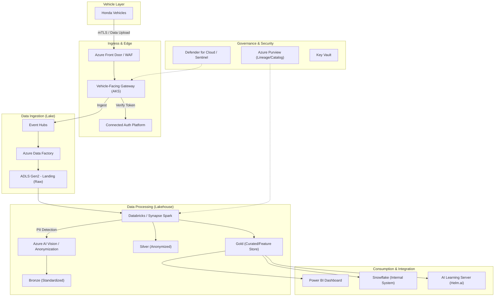

# NOA OutCAR DataOps - Architecture Design

## 1. Overview
The NOA (Navigation On Autopilot) DataOps Server is a critical foundation for Honda's next-generation connected services and Software-Defined Vehicle (SDV) domain. Its primary purpose is to collect high-volume image and video data from vehicles to support the development and training of ADAS (Advanced Driver Assistance Systems) AI models. The system is designed to be highly scalable, secure, and cost-optimized, supporting a transition from 1 million vehicles in 2026 to over 6.5 million vehicles by 2040.

## 2. Requirements (Functional & Non-Functional)

### Functional Requirements
- **Vehicle Authentication:** Secure authentication of Honda vehicles and issuance of communication tokens.
- **File Distribution:** Management and delivery of provisioning and trigger files to control data collection dynamically.
- **Data Collection:** High-throughput ingestion of compressed binary data (images, video, sensors).
- **Data Processing:** RAW data processing, metadata tagging, and anonymization (PII masking).
- **Data Storage:** Multi-tier storage (Hot, Cool, Archive) for cost optimization.
- **AI/ML Integration:** Providing a clean data lake for AI model development and training platforms.
- **Data Sharing:** Integration with internal systems like Snowflake for analytics.
- **Management Dashboards:** Visualization of data collection status, logs, and KPIs.

### Non-Functional Requirements
- **Scalability:** Horizontal scaling to handle up to 65TB of data and 65,000 requests per second (rps) by 2040.
- **Availability:** 99.9%+ availability for production environments.
- **Reliability:** Support for resumable uploads, automatic retries with exponential backoff, and dead-letter queues.
- **Security:** Zero-trust architecture, mTLS for vehicle communication, encryption at rest/transit, and PII compliance (GDPR/APPI).
- **Cost Efficiency:** Edge pre-processing to reduce upload volume and automated storage lifecycle management.
- **Cloud Agnostic Design:** Using containerization (K8s) and IaC (Terraform) to avoid vendor lock-in.

## 3. Architecture Diagram

## 4. Component Design

### Vehicle-Facing Gateway
- **Technology:** Java Spring Boot on Azure Kubernetes Service (AKS).
- **Functions:** Handles authentication handshake, validates JWTs, manages pre-signed URL generation for large uploads, and processes small file uploads directly via API.

### Data Processing Pipeline (Medallion Architecture)
- **Bronze Layer:** RAW data ingestion with original fidelity.
- **Silver Layer:** Cleaned data, H.265 re-encoding if necessary, and "Natural Anonymization" where PII (faces, license plates) is replaced by AI-generated overlays to preserve training value while ensuring privacy.
- **Gold Layer:** Fully tagged and indexed data ready for consumption by AI training workloads.

### Configuration Management
- **Trigger Files:** Dynamic configuration sent to vehicles to specify what data to collect and under what conditions (e.g., specific GPS area, sensor trigger).
- **Provisioning:** Directs vehicles to the correct server endpoints.

## 5. Data Flow
1. **Authentication:** Vehicle initiates mTLS connection -> Gateway validates certificate -> Connected Auth Platform issues Access/Refresh JWT.
2. **Data Upload:**
   - **Large Files (>10MB):** Gateway provides a SAS (Shared Access Signature) token -> Vehicle uploads directly to Cloud Storage in 5MB-10MB chunks (resumable).
   - **Small Files (<=10MB):** Vehicle sends data via API -> Gateway performs virus scan -> Writes to Cloud Storage.
3. **Processing:** Event Grid triggers Databricks/Synapse job -> RAW data moved to Bronze -> Anonymization service called -> Transformed data stored in Silver -> Metadata extracted and stored in Gold (Parquet format).
4. **Consumption:** AI engineers query Gold layer via SQL or direct file access for model training.

## 6. API Contracts
- `POST /v1/auth/token`: Exchanges client certificate for JWT.
- `GET /v1/provisioning`: Retrieves connectivity settings.
- `GET /v1/trigger`: Retrieves data collection logic.
- `POST /v1/upload/init`: Starts multipart upload session (returns SAS URL).
- `POST /v1/upload/complete`: Finalizes data upload and triggers processing.

## 7. Security Architecture
- **Identity:** Okta for internal user RBAC; PKI/mTLS for vehicle identity.
- **Infrastructure Security:** Private Link for all storage/database access, Azure Firewall for egress control, and WAF for ingress protection.
- **Data Privacy:** Automated PII detection and masking integrated into the ETL pipeline. Immutable audit logs for all data deletion requests (GDPR compliance).

## 8. Scalability & Performance
- **Compute:** AKS with Horizontal Pod Autoscaler (HPA) and Cluster Autoscaler.
- **Messaging:** Event Hubs with Auto-inflate for high-throughput streaming.
- **Storage:** ADLS Gen2 scales to exabytes; tiered storage policies automatically move old data to Cool/Archive tiers to save costs (up to 85% reduction).

## 9. Deployment Architecture
- **Infrastructure as Code:** 100% Terraform-managed resources.
- **CI/CD:** Azure DevOps pipelines for automated build, test, and blue/green deployments.
- **Multi-Region:** Deployed across Tokyo (Primary) and Oregon (Secondary) regions for high availability and global coverage.

## 10. Monitoring & Alerting
- **Logging:** Centralized Log Analytics workspace.
- **Observability:** Datadog for real-time metrics, tracing, and custom dashboards.
- **Alerting:** Automated alerts via PagerDuty/Slack for latency spikes, upload failures, or resource saturation.

## 11. Risks & Mitigations
- **Risk:** High data transfer costs between cloud providers.
  - **Mitigation:** Edge pre-processing and localized ingestion hubs; strategic use of Reserved Instances and Spot instances for non-critical processing.
- **Risk:** Incomplete anonymization leading to regulatory breach.
  - **Mitigation:** Multi-stage validation of AI anonymization quality and fallback to blurring for high-uncertainty cases.
- **Risk:** Vehicle connectivity instability during large uploads.
  - **Mitigation:** Resumable multipart upload protocol with robust checksum verification.
