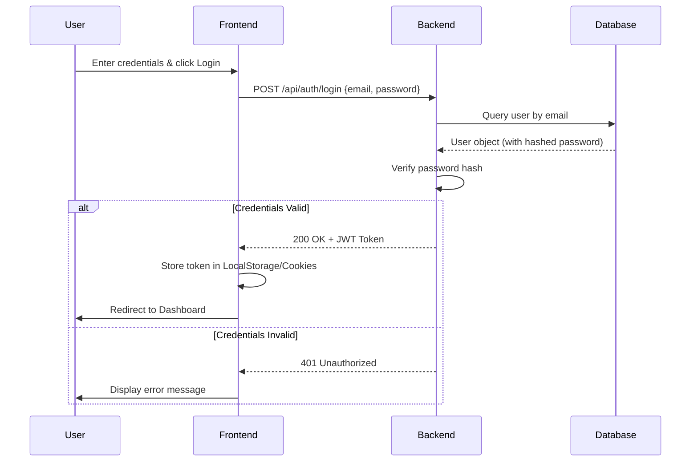
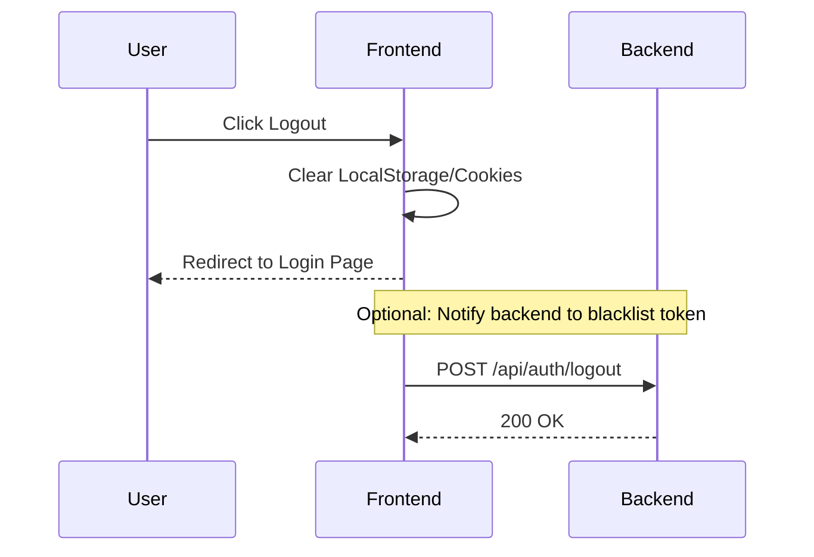
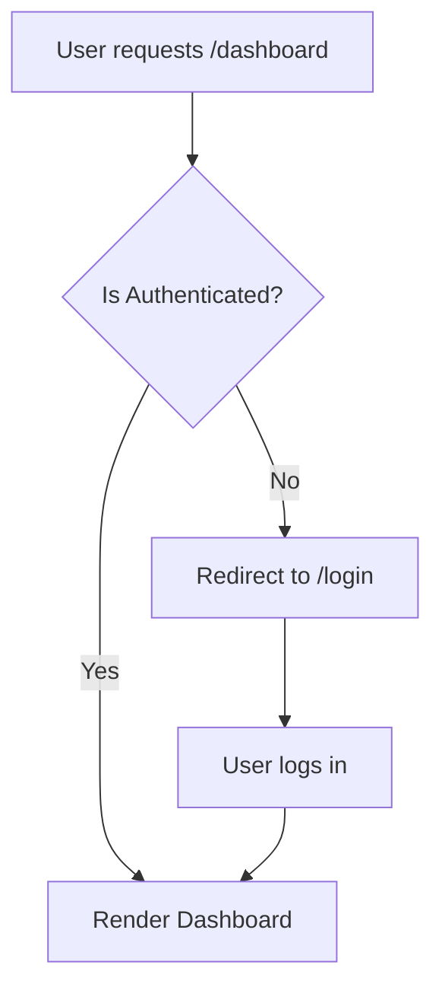

# Use Cases and Workflows: Login Functionality

## 1. Use Case Diagram

```mermaid
useCaseDiagram
    User -> (Login)
    User -> (Logout)
    User -> (Request Password Reset)
    (Login) ..> (Validate Credentials) : include
    (Login) ..> (Show Dashboard) : secondary
```

## 2. Login Workflow (Sequence Diagram)



## 3. Logout Workflow



## 4. Protected Route Guard Workflow


