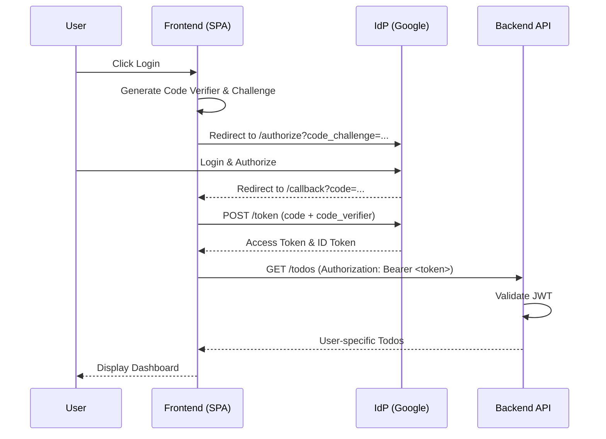

# Use Cases and Workflows - SSO

## 1. Use Case Diagram (Conceptual)
*   **Actors**: User, Identity Provider (Google), Backend API.
*   **Use Cases**:
    *   UC-1: Authenticate via Google
    *   UC-2: Logout
    *   UC-3: Manage Private Todos
    *   UC-4: Validate Session

## 2. Detailed Use Cases

### UC-1: Authenticate via Google
- **Primary Actor**: User
- **Preconditions**: User is on the landing page and not authenticated.
- **Main Success Scenario**:
    1. User clicks "Login with Google".
    2. System redirects User to Google Authentication service.
    3. User enters credentials and approves access.
    4. Google redirects User back to the application with an authorization code.
    5. Application exchanges code for Access Token and ID Token.
    6. System verifies tokens and establishes a session.
    7. System redirects User to the Dashboard.
- **Extensions**:
    *   3a. User cancels login: User is redirected back to the landing page.
    *   5a. Invalid code: System displays an authentication error message.

### UC-2: Logout
- **Primary Actor**: User
- **Preconditions**: User is authenticated.
- **Main Success Scenario**:
    1. User clicks "Logout".
    2. System clears local session tokens.
    3. System redirects User to the landing page.
- **Extensions**:
    *   None.

### UC-3: Create Private Todo
- **Primary Actor**: User
- **Preconditions**: User is authenticated.
- **Main Success Scenario**:
    1. User enters todo details and submits.
    2. Application sends POST request with Bearer token.
    3. Backend validates token and extracts `user_id`.
    4. Backend saves todo with `user_id`.
    5. System confirms creation to the User.

## 3. Workflows

### 3.1 Authentication Sequence (OIDC PKCE)

### 3.2 Token Validation Logic (Backend)
1.  Receive request with `Authorization: Bearer <token>`.
2.  Check if token is present. If not, return 401.
3.  Decode JWT header to find `kid` (Key ID).
4.  Fetch/Retrieve public key from IdP's JWKS endpoint matching `kid`.
5.  Verify signature using the public key.
6.  Verify standard claims:
    - `iss` (Issuer) matches expected IdP URL.
    - `aud` (Audience) matches Application Client ID.
    - `exp` (Expiration) is in the future.
7.  Extract `sub` (Subject) as the unique `user_id`.
8.  Proceed with business logic using `user_id`.
