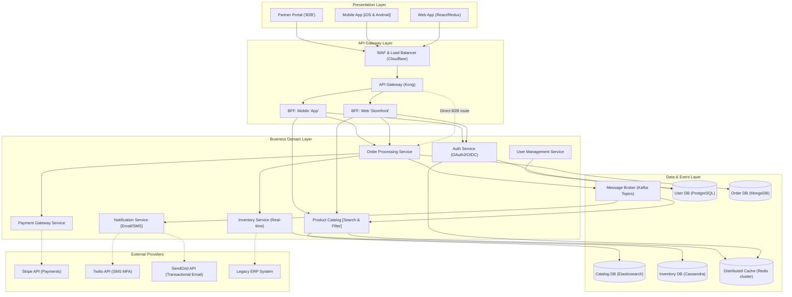
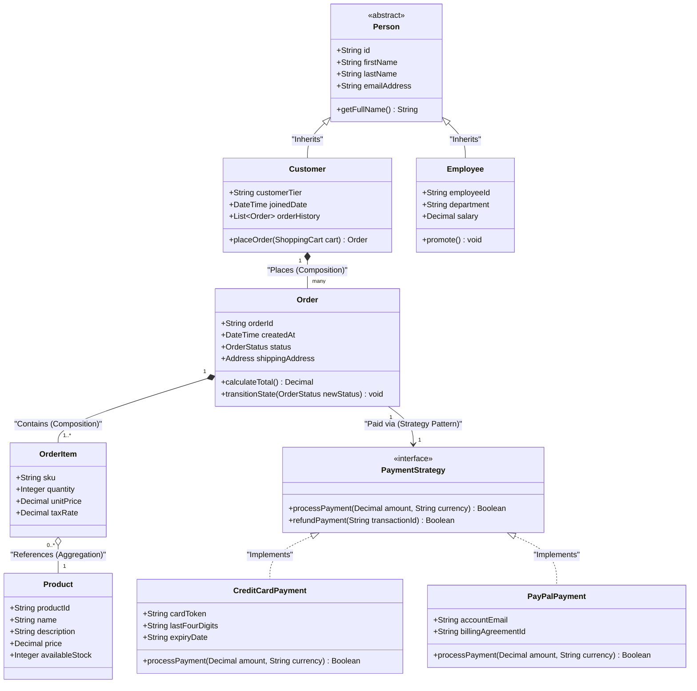
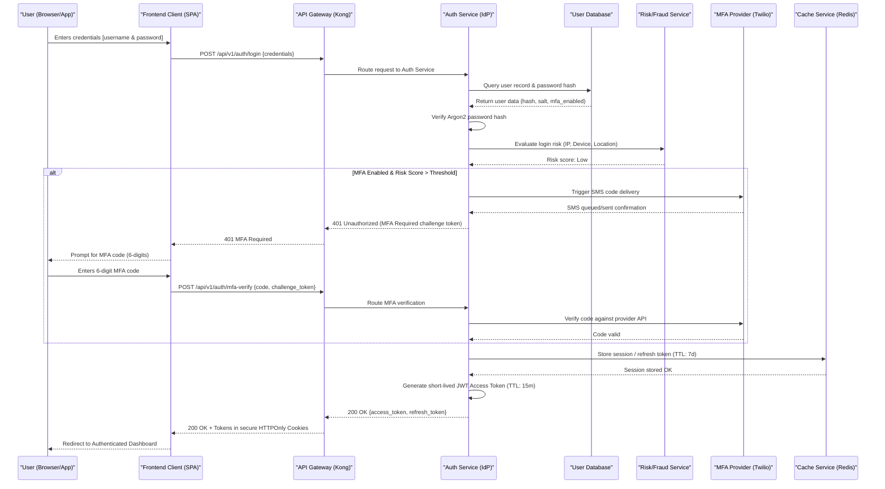
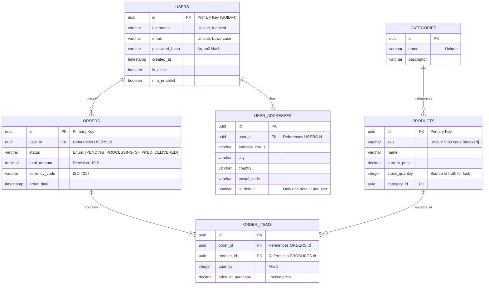

# E-Commerce Cloud Native Platform - Architecture Design

## 1. Overview
This document outlines the system architecture for our next-generation E-Commerce Cloud Native Platform. The architecture is designed to support high scalability, global availability, and rapid feature iteration through a microservices-based approach. The primary goal is to handle peak traffic events (e.g., Black Friday) with zero downtime while providing a seamless user experience across web, mobile, and B2B partner portals.

## 2. Requirements

### Functional Requirements
- Secure user authentication, profile management, and multi-factor authentication (MFA).
- Product catalog browsing, searching, and filtering.
- Real-time inventory tracking and reservation during the checkout process.
- Secure payment processing via third-party gateways (Stripe, PayPal).
- Order lifecycle management and tracking notifications.
- B2B partner API access for bulk order processing.

### Non-Functional Requirements
- **Availability:** 99.99% uptime SLA.
- **Scalability:** Auto-scale up to 100,000 concurrent active users.
- **Latency:** API response times under 200ms at the 95th percentile.
- **Security:** End-to-end encryption, strict RBAC/ABAC authorization, and PCI-DSS compliance scope reduction.
- **Observability:** Centralized logging, distributed tracing, and real-time alerting.

## 3. Architecture Diagram

The system employs an API Gateway pattern with Backend-for-Frontend (BFF) layers, isolating external clients from internal microservices. Communication between internal services occurs via synchronous gRPC/REST and asynchronous event-driven messaging using Kafka.

## 4. Component Design (Domain Model)

Our core domain relies on Domain-Driven Design (DDD) principles. The diagram below models the critical aggregates around `Order`, `Product`, and `Customer` entities, heavily utilizing inheritance and composition patterns.

## 5. Data Flow & Authentication

Secure authentication is paramount. We implement an OAuth2.0 with OIDC flow, supported by a specialized MFA sequence. This ensures minimal attack vectors by restricting direct access to backend microservices.

## 6. Data Architecture (Database Schema)

We employ a polyglot persistence strategy. The following Entity-Relationship Diagram outlines the core relational data model housed within our primary PostgreSQL instance, specifically handling User profiles and transactional Order records.

## 7. Security Architecture
- **Identity & Access Management:** OAuth2/OIDC centralized in Auth Service. All inter-service communication requires validated, internal JWTs (mTLS + JWT validation).
- **Data at Rest:** All databases utilize AES-256 encryption. Personally Identifiable Information (PII) uses application-level field encryption before persistence.
- **Data in Transit:** TLS 1.3 enforced across all external and internal endpoints.

## 8. Scalability & Performance
- **Read-Heavy Workloads:** `CatalogService` relies heavily on Elasticsearch and a Redis cache-aside pattern to ensure sub-50ms latency for product searches.
- **Write-Heavy Workloads:** `OrderService` employs the Saga Pattern for distributed transactions and uses Kafka to offload asynchronous processing (e.g., triggering fulfillment, sending notifications).

## 9. Deployment Architecture
- **Infrastructure:** Kubernetes (EKS/GKE) across multi-AZ configurations. 
- **CI/CD:** ArgoCD for GitOps-based continuous deployment.
- **Service Mesh:** Istio implemented for traffic routing, fault injection, circuit breaking, and mTLS between pods.

## 10. Monitoring & Alerting
- **Metrics:** Prometheus polling /metrics endpoints exposed by microservices.
- **Tracing:** OpenTelemetry embedded in all services, exporting traces to Jaeger/Tempo.
- **Logging:** Structured JSON logs aggregated via FluentBit to an ELK or Grafana Loki stack.

## 11. Risks & Mitigations
| Risk | Probability | Impact | Mitigation Strategy |
|------|-------------|--------|---------------------|
| Kafka broker failure causing event loss | Low | High | Deploy Kafka in highly available clusters with `min.insync.replicas=2` and `acks=all`. |
| Distributed transaction failure in Order processing | Medium | High | Implement strict Saga pattern with robust compensating transactions (rollbacks) for Inventory and Payment stages. |
| Cache stampede during flash sales | High | Medium | Implement probabilistic early expiration (cache jitter) and request coalescing in the BFF layers. |
