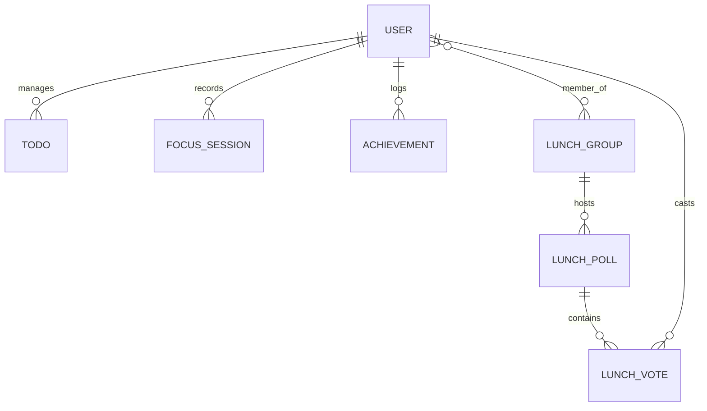

# Data Architecture: SORA (Smart Office Routine Assistant)

## 1. Overview
SORA's data architecture is designed for low-latency retrieval of personal routine data while maintaining a clean separation between user identity and productivity metadata. It uses a relational model to ensure data integrity for features like team lunch voting and task history.

## 2. Conceptual Data Model

## 3. Physical Schema (Proposed)

### 3.1 Core Tables (Existing)

#### `users`
| Column | Type | Constraints | Description |
| :--- | :--- | :--- | :--- |
| id | String(100) | PK | Unique ID (OIDC `sub`). |
| email | String(255) | Unique, Indexed | Primary contact. |
| name | String(255) | | Full display name. |
| picture | String(500) | | URL to profile image. |
| last_login | DateTime | | Activity tracking. |

#### `todos`
| Column | Type | Constraints | Description |
| :--- | :--- | :--- | :--- |
| id | Integer | PK, AI | Unique task ID. |
| user_id | String(100) | FK (users.id) | Ownership. |
| title | String(200) | Not Null | Task content. |
| description| String(500) | | Optional details. |
| completed | Boolean | Default: False | Status. |
| created_at | DateTime | | |
| updated_at | DateTime | | |

### 3.2 SORA Extension Tables (New)

#### `focus_sessions`
| Column | Type | Description |
| :--- | :--- | :--- |
| id | UUID | Primary Key. |
| user_id | String(100) | FK to `users`. |
| start_time | DateTime | Actual start. |
| end_time | DateTime | Expected/Actual end. |
| interrupted | Boolean | Flag if user broke focus. |

#### `achievements` (Wins)
| Column | Type | Description |
| :--- | :--- | :--- |
| id | Integer | Primary Key. |
| user_id | String(100) | FK to `users`. |
| content | String(500) | The "Win" description. |
| logged_at | Date | Usually associated with Evening Wrap-up. |

#### `lunch_polls` & `votes`
- **Lunch Polls**: Stores active voting sessions for a group.
- **Lunch Votes**: Junction table linking `user_id`, `poll_id`, and `option_id`.

## 4. Data Governance & Privacy
- **Metadata Only Policy:** No storage of meeting body content or private notes. Only time, title, and location metadata are persisted.
- **Retention:** Focus session logs and achievements are kept for 90 days for trend analysis before archival.
- **Anonymization:** For team features (lunch polls), votes are stored with a hashed user ID to maintain privacy within the group.

## 5. Storage Strategy
- **Hot Data:** Active focus timers and today's briefing data are cached in **Redis** for sub-100ms access.
- **Persistent Data:** **PostgreSQL** (Production) or **SQLite** (Edge/Local) for relational integrity.
- **Cold Data:** Historical stats older than 1 year are moved to Parquet files on **S3** for cost-effective analytics.
