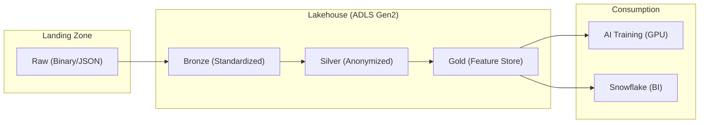

# Data Architecture: NOA OutCAR DataOps

## 1. Overview
The NOA OutCAR DataOps platform manages the lifecycle of high-resolution sensor data (video, images, telemetry) from Honda's vehicle fleet. It employs a Lakehouse architecture (Medallion pattern) to transform raw, privacy-sensitive data into high-quality training sets for ADAS AI models.

## 2. Medallion Data Flow

### 2.1 Layer Definitions
- **Bronze (Standardized)**: Data converted from vehicle-specific binary formats into standardized formats (e.g., Protobuf/Avro). Includes original sensor fidelity and raw metadata.
- **Silver (Anonymized)**: Data after "Natural Anonymization". PII (faces, license plates) is masked or replaced with AI-generated synthetic content. Video re-encoded to H.265 if needed.
- **Gold (Curated/Feature Store)**: Fully tagged and indexed data. Metadata is stored in Parquet/Delta Lake format. Optimized for random access by AI training clusters.

### 2.2 Processing Optimization: Selective Anonymization
To manage GPU compute costs at PB-scale, the system follows a "Just-in-Time" anonymization strategy:
1. **Landing/Bronze**: All data is ingested and stored in the secure Landing/Bronze zones.
2. **Tagging**: Automated or manual tagging identifies high-value clips for AI training.
3. **Triggered Silver**: Anonymization is triggered *only* for tagged clips or when a dataset is requested for export to the AI training cluster.
4. **Result**: 80-90% reduction in GPU compute requirements by avoiding anonymization of "junk" or unused raw data.

### 2.3 Data Quality Framework
To ensure the integrity of the AI training pipeline, a Data Quality (DQ) layer is integrated between the Bronze and Silver layers:
- **Validation Checks**: Automated detection of lens obstruction (mud/rain), sensor misalignment, and data corruption in binary streams.
- **Quality Scoring**: Every data clip is assigned a `quality_score` (0.0 - 1.0). Clips below a threshold (e.g., 0.7) are excluded from the Silver layer processing and flagged for review.
- **Reporting**: Daily DQ summaries are sent to the DataOps team to identify potential fleet-wide sensor issues.

## 3. Data Schema (Metadata)

### 3.1 `vehicle_sessions`
| Column | Type | Description |
| :--- | :--- | :--- |
| session_id | UUID (PK) | Unique upload session. |
| vehicle_id | String | Unique vehicle identifier. |
| region_id | String | Ingestion region (e.g., JP-TOKYO). |
| start_time | Timestamp | Session start. |
| end_time | Timestamp | Session end. |

### 3.2 `sensor_data_index`
| Column | Type | Description |
| :--- | :--- | :--- |
| file_id | UUID (PK) | Pointer to blob storage. |
| session_id | UUID (FK) | Link to session. |
| sensor_type | Enum | CAMERA_FRONT, LIDAR, RADAR, GPS. |
| timestamp | Timestamp | Precise sensor capture time. |
| location | PostGIS/GeoJSON | GPS coordinates at capture. |
| anonymized | Boolean | Status of PII masking. |

## 4. Storage Lifecycle & Cost Optimization
| Tier | Retention | Storage Class | Cost Factor |
| :--- | :--- | :--- | :--- |
| **Hot** | 0-30 Days | Azure Premium Blob | 100x |
| **Cool** | 30-365 Days | Azure Cool Blob | 20x |
| **Archive** | 1-7+ Years | Azure Archive (Offline) | 1x |

- **Automatic Transition**: Lifecycle policies move data to "Cool" after 30 days of no access.
- **Archive Trigger**: Raw data (Bronze) is moved to Archive after Silver transformation is verified.

## 5. Governance & Compliance
- **PII Compliance**: Automated detection and masking integrated into the Bronze -> Silver transition.
- **Lineage**: Tracked via Azure Purview from vehicle ingestion to Gold layer.
- **Deletion (GDPR)**: Vehicles can request deletion by `vehicle_id`. The system uses partition-level deletion for efficiency where possible.
