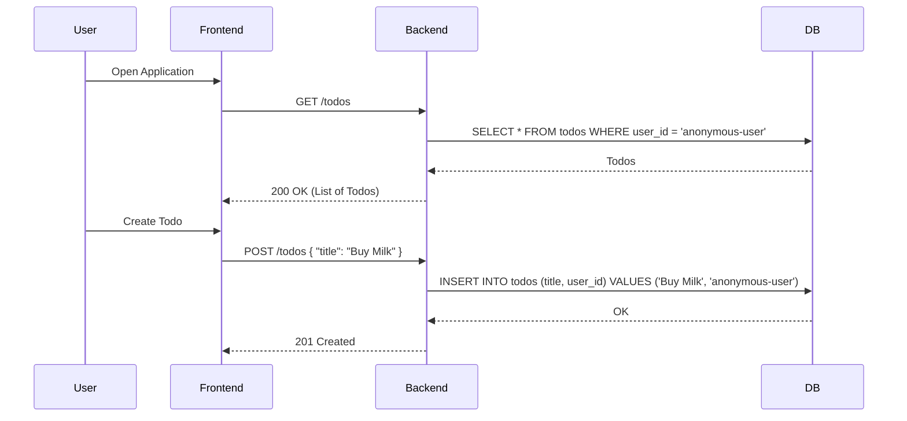

# Non-SSO System Design

## 1. Overview
This document describes the design for the Todo Application without Single Sign-On (SSO) authentication. The application operates in a "no-auth" or "single-user" mode where identity management is simplified or removed.

## 2. Architecture

### 2.1 Components
- **Frontend (React)**:
    - No longer handles OIDC flows or login redirections.
    - Communicates with the backend without providing authentication tokens.
- **Backend (FastAPI)**:
    - Does not validate JWTs.
    - Operates on a default user identity for all operations to maintain database compatibility.
- **Database (SQLite)**:
    - Stores todos associated with a static default user ID.

### 2.2 Sequence Diagram

## 3. Data Model

The data model remains largely unchanged to ensure backward compatibility with existing data, but the interpretation of identity is simplified.

### 3.1 `todos` Table
Remains unchanged, but the `user_id` column is populated with a constant value.

| Column | Type | Value |
| :--- | :--- | :--- |
| user_id | String | Hardcoded to 'anonymous-user'. |

### 3.2 `users` Table
This table is effectively deprecated. A single record for 'anonymous-user' may be created during initialization to satisfy foreign key constraints.

## 4. Security Considerations

- **Authentication**: None. The application is accessible by anyone with network access to the server.
- **Environment**: It is highly recommended to deploy this application behind a VPN or an authenticating reverse proxy if exposed to the public internet.
- **Data Isolation**: None. All users share the same todo list.

## 5. Deployment Simplification

- **No IdP Dependency**: No need to configure Client IDs, Secrets, or Redirect URIs.
- **Environment Variables**: No OIDC-related environment variables are required.
- **Offline Capability**: The application can run entirely offline without needing to contact an Identity Provider for public keys or token verification.
