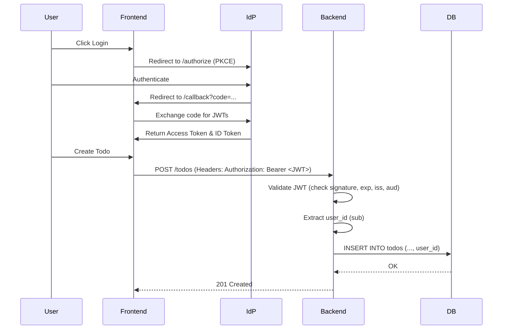

# SSO System Design

## 1. Overview
This document describes the design for integrating Single Sign-On (SSO) into the Todo Application using OpenID Connect (OIDC).

## 2. Architecture

### 2.1 Components
- **Identity Provider (IdP)**: External service (e.g., Google, Auth0) that handles user authentication and issues JWTs.
- **Frontend (React)**:
    - Responsible for initiating the OIDC flow.
    - Stores the Access Token in memory (not localStorage for better security).
    - Attaches the Access Token to outgoing API requests.
- **Backend (FastAPI)**:
    - Validates the Access Token on every protected request.
    - Extracts the `sub` (subject) claim from the JWT to identify the user.
    - Filters database queries based on the user ID.

### 2.2 Sequence Diagram

## 3. Data Model Changes

### 3.1 `todos` Table
Add a `user_id` column to associate todos with a specific user.

| Column | Type | Description |
| :--- | :--- | :--- |
| user_id | String | The unique ID from the IdP (usually the `sub` claim). |

### 3.2 `users` Table (Optional but recommended)
Used to store user profile information synchronized from the IdP.

| Column | Type | Description |
| :--- | :--- | :--- |
| id | String (PK) | The `sub` claim from the JWT. |
| email | String | User's email address. |
| name | String | User's full name. |
| last_login | DateTime | Timestamp of the last authentication. |

## 4. Security Considerations

- **JWT Validation**: The backend MUST validate the JWT signature using the IdP's public keys fetched via the `.well-known/openid-configuration` and `jwks_uri`.
- **Token Storage**: Use secure cookie-based session or in-memory storage in the frontend to mitigate XSS attacks.
- **HTTPS**: All communication between components must be over HTTPS.
- **Scopes**: Request minimal scopes (e.g., `openid`, `profile`, `email`).
- **PKCE**: Mandatory for SPA to prevent authorization code injection attacks.

## 5. Implementation Steps

1. **IdP Setup**: Register the application in the IdP console (e.g., Google Cloud Console) and obtain a Client ID.
2. **Database Migration**: Add `user_id` to the `todos` table and create the `users` table.
3. **Backend Middleware**: Implement a FastAPI dependency that validates the Bearer token.
4. **Backend Logic**: Update all Todo endpoints to use the authenticated `user_id`.
5. **Frontend Integration**: Install an OIDC library and wrap the app in an AuthProvider.
6. **Frontend UI**: Add Login/Logout buttons and handle the authenticated state.
