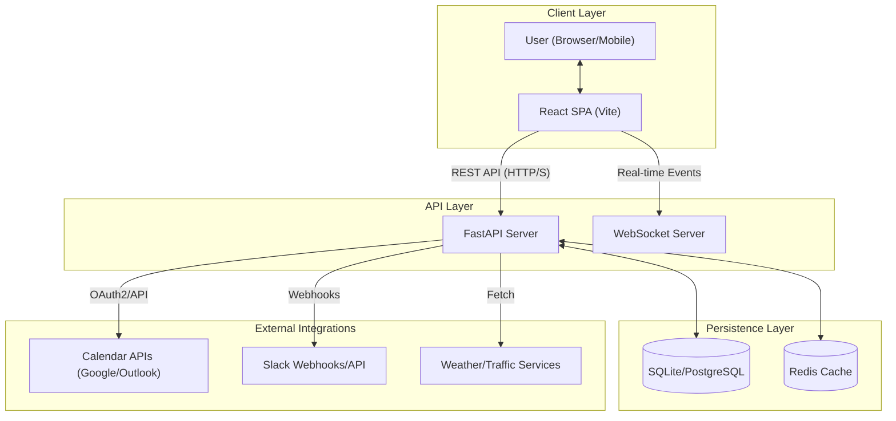
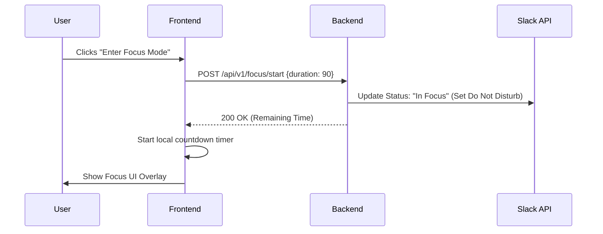

# SORA (Smart Office Routine Assistant) - Architecture Design

## 1. Overview
The Smart Office Routine Assistant (SORA) is a productivity platform designed to reduce cognitive load for office workers. It automates daily transitions (morning briefing, evening wrap-up), protects deep work intervals by managing communication status, and facilitates team coordination (lunch orchestration).

## 2. Requirements (Functional & Non-Functional)

### 2.1 Functional Requirements
- **FR-001 (Morning Briefing):** Delivery of summary data including first meeting, weather, and commute at 8:30 AM.
- **FR-002 (Deep Work Shield):** Automated detection of calendar gaps and "Focus Mode" activation (Slack/Teams status update).
- **FR-003 (Lunch Orchestrator):** Group polling for meal preferences and suggestions.
- **FR-004 (Clean Slate Wrap-up):** Achievement logging and prioritized task generation for the next day.

### 2.2 Non-Functional Requirements
- **NFR-001 (Privacy):** No storage of sensitive meeting content; metadata only.
- **NFR-002 (Latency):** < 2s delivery for time-sensitive notifications.
- **NFR-003 (Integrations):** Seamless connectivity with Microsoft Outlook, Google Calendar, and Slack.
- **NFR-004 (Scalability):** Support for up to 10,000 concurrent users with local-first data caching.

## 3. Architecture Diagram

## 4. Component Design

### 4.1 Frontend Components
- **Dashboard Widget Engine:** Pluggable widgets for Briefing, Focus Mode, and Lunch Polls.
- **Ritual Wizard:** A multi-step form for Morning/Evening routines.
- **Focus Store (Zustand):** Manages local timer state and UI blocking.
- **API Client (TanStack Query):** Handles server state, caching, and optimistic updates.

### 4.2 Backend Services
- **Briefing Engine:** Aggregates data from Weather, Traffic, and Calendar services.
- **Focus Manager:** Monitors calendar gaps and triggers status updates.
- **Notification Service:** Dispatches WebSocket events and push notifications.
- **Task Prioritization Logic:** Analyzes "Wins" and pending todos to suggest tomorrow's "Top 3".

## 5. Data Flow

### 5.1 Focus Mode Activation

## 6. API Contracts
Managed in detail in [api-contract.md](./api-contract.md). Primary patterns:
- **REST:** JSON-based resources for todos, briefings, and logs.
- **WebSocket:** Event-driven updates for `BRIEFING_READY` and `LUNCH_POLL_STARTED`.

## 7. Security Architecture
- **Authentication:** Currently disabled for MVP; planned migration to OAuth2/OIDC.
- **Authorization:** Token-based access to external integrations (Calendar/Slack).
- **Data Protection:** Encryption at rest for user metadata; PII minimization.

## 8. Scalability & Performance
- **Caching:** Weather and traffic data cached in Redis (TTL: 15-30 mins).
- **Asynchronous Processing:** Long-running briefing generations handled via background tasks.
- **Static Content:** Frontend assets served via global CDN.

## 9. Deployment Architecture
- **Environment:** Containerized deployment using Docker.
- **Infrastructure:**
    - Frontend: Vercel/Netlify.
    - Backend: AWS Fargate (ECS).
    - Database: RDS for PostgreSQL (Production) / SQLite (Development).

## 10. Monitoring & Alerting
- **Observability:** Structured logging (JSON) and tracing.
- **Metrics:** Request latency, error rates, and integration uptime.
- **Alerting:** Automated triggers for failing external API integrations.

## 11. Risks & Mitigations
- **Risk:** External API Rate Limiting (Calendar/Slack).
    - **Mitigation:** Implement exponential backoff and request batching.
- **Risk:** Stale Commute Data.
    - **Mitigation:** Real-time fetch with strict timeouts and fallback to "last known good" status.
- **Risk:** Notification Fatigue.
    - **Mitigation:** User-configurable threshold for "Focus Mode" suggestions.
