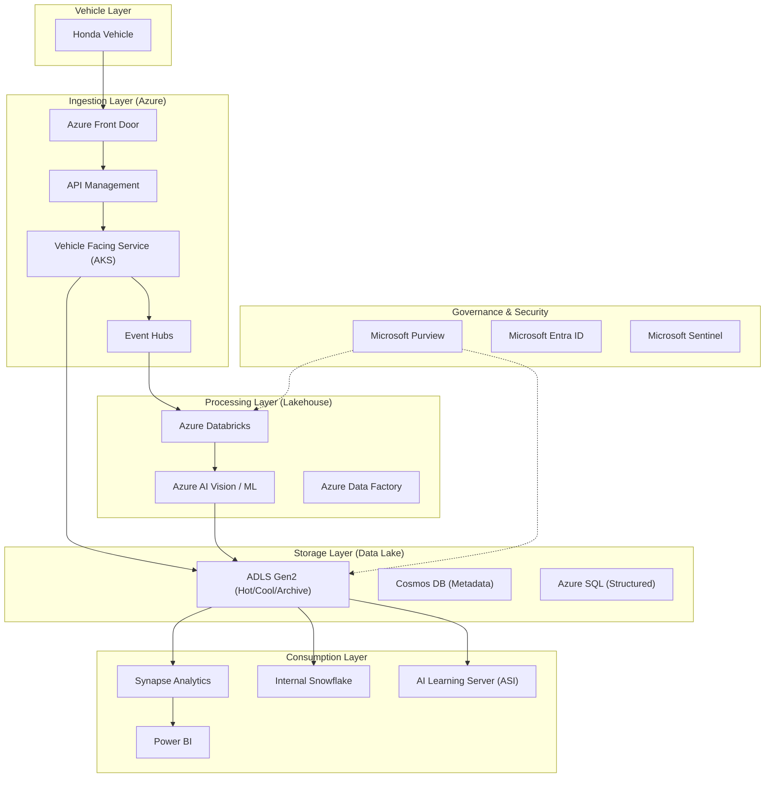

# NOA OutCAR DataOps Server - Architecture Design

## 1. Overview
The NOA (Navigation On Autopilot) DataOps Server is a critical infrastructure component for Honda's next-generation connected services and Software Defined Vehicle (SDV) initiative. Its primary purpose is to collect, process, and manage large-scale video and sensor data from vehicles to support the development and training of Advanced Driver Assistance Systems (ADAS) AI models.

The system aims to transition from the current Phase 0/1 towards a scalable, multi-cloud ready platform capable of handling millions of connected vehicles by 2030 and beyond.

## 2. Requirements

### 2.1 Functional Requirements
- **Vehicle Authentication**: Securely authenticate Honda vehicles and issue communication tokens.
- **File Delivery**: Manage and deliver provisioning and trigger files to vehicles to dynamically control data collection conditions.
- **Data Ingestion**: High-throughput ingestion of compressed binary data (video/sensor) from vehicles.
- **Data Processing**: Pre-processing of RAW data, including metadata extraction, tagging, and computer vision tasks (object detection).
- **Anonymization**: Automated PII (Personally Identifiable Information) detection and "Natural Anonymization" using AI to replace faces and license plates.
- **Data Storage**: Multi-tiered storage of RAW and processed data with defined lifecycle policies.
- **Data Sharing**: Provide a high-performance data lake/warehouse for AI engineers and external systems (e.g., Snowflake, ASI).
- **Management Portal**: Web interface for administrative tasks, configuration management, and data exploration.

### 2.2 Non-Functional Requirements
- **Scalability**: Support 1M vehicles (1TB/day) in the short term, scaling to 6.5M vehicles (65TB/day) by 2040.
- **Availability**: Target 99.9%+ availability with multi-AZ deployment.
- **Performance**: High-throughput automated pipelines to prevent data backlogs.
- **Security**: Zero-trust architecture, mTLS, JWT-based authorization, and compliance with global privacy regulations (APPI, GDPR, CCPA).
- **Cost Optimization**: Intelligent data lifecycle management and tiering to reduce storage and egress costs.
- **Interoperability**: Support for open table formats (Delta Lake/Iceberg) to avoid vendor lock-in.

## 3. Architecture Diagram

## 4. Component Design

### 4.1 Vehicle-Facing (VF) Service
- **Technology**: Java/Spring Boot on AKS.
- **Responsibility**: Handles mTLS termination, JWT validation, provisioning file distribution, and multi-part upload coordination.

### 4.2 Data Ingestion Pipeline
- **Small Files (<10MB)**: Direct upload via API Service to Storage.
- **Large Files (>10MB)**: Multi-part upload using Pre-signed URLs (SAS tokens) to bypass API bottlenecks.

### 4.3 Processing Engine (Databricks)
- **Framework**: Medallion Architecture (Bronze -> Silver -> Gold).
- **Bronze**: RAW data landing and schema validation.
- **Silver**: Anonymized, cleansed data in Delta Lake format.
- **Gold**: Curated, aggregated data ready for AI training and BI.

### 4.4 Anonymization Module
- Uses Generative AI to replace PII with synthetic data (Natural Anonymization) to preserve data utility for AI training while ensuring privacy compliance.

## 5. Data Flow
1. **Trigger**: Vehicle receives a trigger file or detects an event (e.g., airbag deployment).
2. **Auth**: Vehicle authenticates via mTLS and receives a JWT.
3. **Ingest**: Vehicle uploads data chunks to ADLS Gen2 using SAS tokens.
4. **Notify**: Upload completion triggers an event in Event Grid/Event Hubs.
5. **Process**: Databricks Auto Loader picks up files for processing (extraction, tagging, anonymization).
6. **Store**: Processed data is saved to Silver/Gold layers.
7. **Export**: Metadata and data links are shared with ASI and Snowflake.

## 6. API Contracts (High-Level)
- `POST /auth/login`: Vehicle authentication using client certificates.
- `GET /provisioning`: Fetch server connection details.
- `GET /trigger`: Fetch data collection conditions.
- `POST /data/initUpload`: Initialize multi-part upload.
- `POST /data/completeUpload`: Finalize upload and trigger processing.

## 7. Security Architecture
- **Authentication**: mTLS for device-to-cloud, Okta/Entra ID for user-to-cloud.
- **Authorization**: RBAC and Attribute-Based Access Control (ABAC) via Microsoft Purview.
- **Data Protection**: Encryption at rest (CMK) and in transit (TLS 1.3).
- **Threat Detection**: Integrated with Azure Defender for Cloud and Microsoft Sentinel for SIEM/SOAR.

## 8. Scalability & Performance
- **Horizontal Scaling**: AKS Auto-scaling and Databricks clusters.
- **Back-pressure Handling**: Queue-based ingestion via Event Hubs.
- **Storage Tiering**: Automated movement from Hot to Cool/Archive based on age and usage patterns (e.g., delete RAW after 7 days, keep Curated for 6 months).

## 9. Deployment Architecture
- **Infrastructure as Code**: Terraform for environment replication.
- **CI/CD**: Azure DevOps pipelines for automated testing and deployment.
- **Multi-Region**: Initial deployment in Japan (East) and USA (Oregon) for global coverage.

## 10. Monitoring & Alerting
- **Logs/Metrics**: Aggregated in Log Analytics Workspace.
- **Visualization**: Datadog and Power BI dashboards for system health and DataOps KPIs.
- **Alerting**: Automated alerts for ingestion failures, latency spikes, and security incidents.

## 11. Risks & Mitigations
- **Data Volume**: Mitigation through edge pre-processing and aggressive lifecycle management.
- **Privacy Regulations**: Mitigation through automated PII detection and synthetic data replacement.
- **Cloud Lock-in**: Mitigation through the use of K8s, Terraform, and Open Table Formats (Delta/Iceberg).
